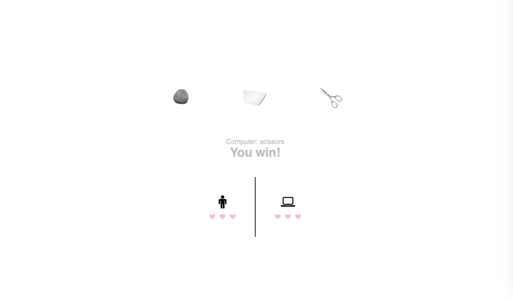

# Rock, Paper or Scissors



Use Cases:
-------

```
- [x] As a User,
      So that I can play a basic game of Rock Paper Scissors,
      I want to choose rock, paper or scissors

- [x] As a User,
      So that I can play a game of Rock Paper Scissors,
      I want to play a best of three rounds match against a computer with randomised choices

- [x] As a User,
      So that I can play a game against a smarter computer player,
      I want to be able choose a computer component that is tactical e.g. always selects the choice that would have beaten its last choice


```
##Approach:

Following challenge specification I have decided to use Javascript language and Karma for unit testing.

##To run the app:
```
git clone https://github.com/5555482/RPS.git
cd RPS
npm install
open index.html
```

##To run the tests:

```
grunt
```
